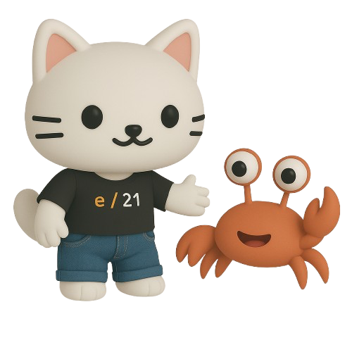

# e/21 entry case

Hi, you survived the first round of "Getting to know the guys", but now we would still like to know how you approach one of our challenges.

That's why we've set up this little case.

It's not about you writing perfect code, we don't do that either, but more about you showing us **HOW** you approach such a problem. You've already heard in the talk that the emphasis is on *Rust* and *JavaScript/TypeScript*, and we're going to test that briefly in this case as well.

## The brief

The case has 6 parts. Depending on your knowledge and experience level, you can complete them one by one. Again, it's not about being technically perfect at programming (that's fine), but more about whether you can set up the underlying structure in a meaningful and stable way.

Set up a GitHub repository and create a branch for each task.

1. **Step 1:** Develop a small Rust program (CLI) that sends a prompt to an LLM (sign up to a free cloud provider is fine, OpenAI, Google Gemini, Nebius etc.) and displays the result in the console
2. **Step 2:** The next step is to pass the prompt as an argument on the CLI.
3. **Step 3:** Read a PDF file as an argument on the CLI and pass the contents as context for the LLM. You also pass the prompt as an argument on the CLI.
4. **Step 4:** Create a [Tauri app](https://tauri.app) that reads the prompt (from your favourite front-end framework such as React or Angular) passes it to the Rust backend and displays the result in the front-end
5. **Step 5:** Can you vectorize the PDF and the prompt and create a real (in memory) RAG out of it?
6. **Step 6:** Modify the Tauri front-end app so the user can specifiy which file should be "RAGged" (File Open dialogue)

Please invite:

* Lee: https://github.com/leenorvall
* Ian: https://github.com/RGGH
* René: https://github.com/ReneKrewinkel

to your repository!

